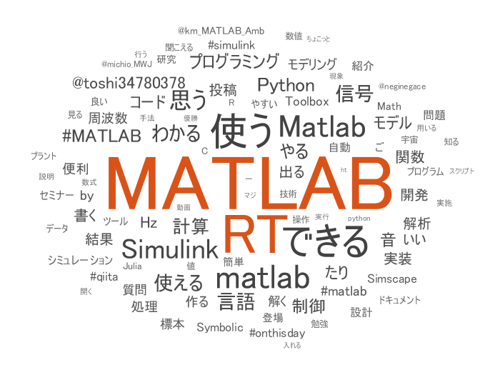
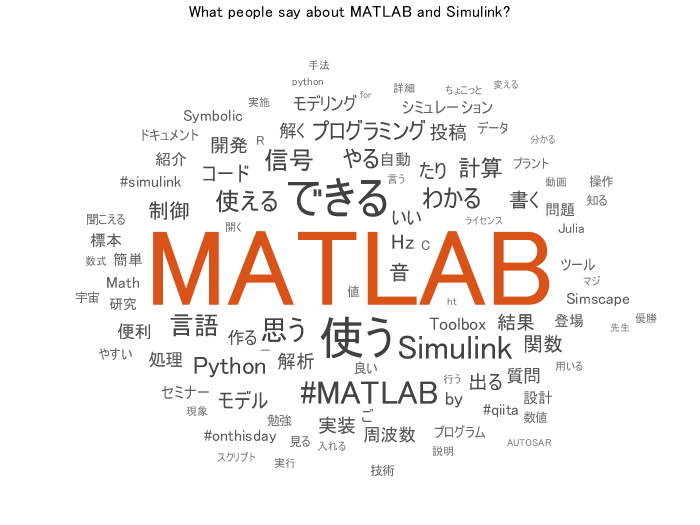
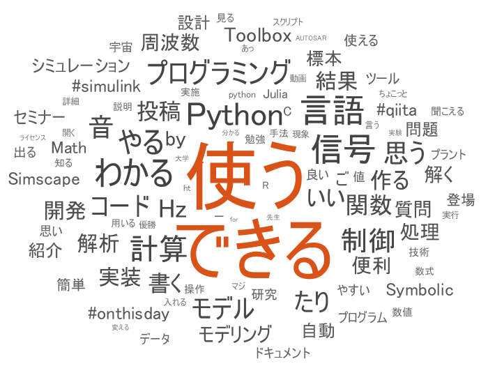
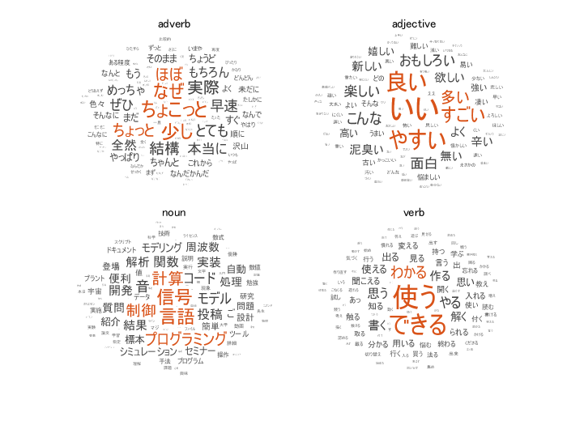

# Tweet のワードクラウド作成からツイートまで
Copyright (c) 2022 Michio Inoue.
# まずは Tweet の取得

Tweet の取得については [Conduct Sentiment Analysis Using Historical Tweets](https://jp.mathworks.com/help/datafeed/conduct-sentiment-analysis-using-historical-tweets.html) がピンポイントの例題としてあるので、こちらを参照します。

ただそのまま使うと省略された Tweet 本文になっちゃうので `'tweet_mode'` を `'extended'` にしておくことを忘れずに！` `

```matlab:Code
% settokens % Twitter API の利用申請は別途必要（ここでは各種 API キーは環境変数として設定しているとします。）
consumerkey = getenv("CONSUMERKEY");
consumersecret = getenv("CONSUMERSECRET");
accesstoken = getenv("ACCESSTOKEN");
accesstokensecret = getenv("ACCESSTOKENSECRET");
```

Twitter オブジェクトの作成（Datafeed Toolbox）

```matlab:Code
c = twitter(consumerkey,consumersecret,accesstoken,accesstokensecret);
c.StatusCode
```

```text:Output
ans = 
  StatusCode の列挙値

    OK

```

OK ということで無事繋がりました。[search 関数](https://jp.mathworks.com/help/datafeed/twitter.search.html)で Tweet の検索結果をとってきます。試しに 100 Tweets とってみます。

```matlab:Code
tweetquery = '"MATLAB" OR "Simulink" lang:ja';
s = search(c,tweetquery,'count',100,'tweet_mode','extended');
```

`statuses` に Tweet の情報が入ります。1 Tweet = 1 構造体で取得されるので、今回の呼び出しだと 100x1 のセル配列として返ってきます。

```matlab:Code
statuses = s.Body.Data.statuses;
whos statuses
```

```text:Output
  Name            Size              Bytes  Class    Attributes

  statuses      100x1             2581021  cell               
```

[search 関数](https://jp.mathworks.com/help/datafeed/twitter.search.html)では Twitter API 仕様上最新の 7 日間の Tweet までしか遡れないことに注意。

また、一度の call で最大 100 Tweet しか取れませんので、繰り返し呼び出す必要があります。`'max_id'` でどこから先のデータを取得するかを指定します。

```matlab:Code
% Retrieve All Available Tweets
while isfield(s.Body.Data.search_metadata,'next_results')
    % Convert results to string
    nextresults = string(s.Body.Data.search_metadata.next_results);
    % Extract maximum Tweet identifier
    max_id = extractBetween(nextresults,"max_id=","&");
    % Convert maximum Tweet identifier to a character vector
    cmax_id = char(max_id);
    % Search for Tweets
    s = search(c,tweetquery,'count',100,'max_id',cmax_id,'tweet_mode','extended');
    % Retrieve Tweet text for each Tweet
    statuses = [statuses;s.Body.Data.statuses];
end
```

```matlab:Code
length(statuses)
```

```text:Output
ans = 700
```

Tweet が取れてますね。

## timetable 型にまとめる

全部取れたら構造体から必要な情報だけ取り出しておきます。ここでは Tweet された時刻（created_at）と Tweet 本文（full_text）です。

```matlab:Code
if iscell(statuses)
    % Unstructured data
    numTweets = length(statuses);             % Determine total number of Tweets
    tweetTimes = cell(numTweets,1);           % Allocate space for Tweet times and Tweet text
    tweetTexts = tweetTimes;
    tweetUsers = tweetTimes;
    tweetSources = tweetTimes;
    for i = 1:numTweets
        tweetTimes{i} = statuses{i}.created_at; % Retrieve the time each Tweet was created
        tweetTexts{i} = statuses{i}.full_text;       % Retrieve the text of each Tweet
        tweetUsers{i} = statuses{i}.user.name;
        tweetSources{i} = statuses{i}.source;
    end
else
    % Structured data
    tweetTimes = {statuses.created_at}';
    tweetTexts = {statuses.text}';
    tweetUsers = {statuses.user.name}';
    tweetSources = {statuses.source}';
end
tweetSources = extractHTMLText(tweetSources);
```

お馴染みの timetable 型にまとめておきます。時刻データのフォーマットに要注意。

```matlab:Code
tweetTimes{1}
```

```text:Output
ans = 'Mon Jun 13 17:53:02 +0000 2022'
```

こんな形で入っています。datetime 型に変換する場合は `'Locale'` を `'en_US'` に設定することをお忘れなく。

```matlab:Code
tweets = timetable(tweetTexts,tweetUsers,tweetSources,'RowTimes', ...
    datetime(tweetTimes,'Format','eee MMM dd HH:mm:ss +SSSS yyyy','Locale','en_US'));
```

Tweet 時刻は +0000 と出ていることから分かるように UTC なので、東京時間に合わせておきます。datetime 型の TimeZone を UTC に設定後、Asia/Tokyo に変えるだけ。

```matlab:Code
tweets.Time.TimeZone = 'UTC';
tweets.Time.TimeZone = 'Asia/Tokyo';
tweets.Time.Format = 'yyyy/MM/dd HH:mm:ss';
% save('tweets20220531.mat','tweets','statuses')
```

これで完成。データは保存しておきます。

# ワードクラウド

このワードクラウドは文字列をそのまま入れているので MATLAB 本体の wordcloud 関数です。

```matlab:Code
wordcloud(tweets.tweetTexts)
```



  
## せっかくなのでちょっと細かい前処理を

上のワードクラウドを見るといくつか気になる点があります。

   -  matlab や MATLAB など大文字小文字の揺らぎ 
   -  RT? 
   -  @ によるメンション 

この辺を処理します。

まず RT。これは Retweet された Tweet が例えば RT @michio_MWJ: ではじまることから登場回数が多くなります。この辺はアカウント名も含めて取り除いておきます。

```matlab:Code
% load tweets20220614.mat
tweets.tweetTexts = string(tweets.tweetTexts);
```

[wildcardPattern](https://jp.mathworks.com/help/matlab/ref/wildcardpattern.html) を使って RT @[アカウント名]: ではじまる Tweet を探して、対象の者は [extractAfter](https://jp.mathworks.com/help/matlab/ref/extractafter.html) でその後に続く本文だけを残す処理にします。

```matlab:Code
pat = "RT @" + wildcardPattern("Except",":") + (":");
idx = contains(tweets.tweetTexts,pat);
tweets.tweetTexts(idx) = extractAfter(tweets.tweetTexts(idx),pat);
```

次に大文字小文字の揺らぎ。これは lower や upper を使って小文字か大文字に揃えてもよいのですが、ここでは [caseInsensitivePattern](https://jp.mathworks.com/help/matlab/ref/caseinsensitivepattern.html) を使って大文字小文字関係なく検索した上で、特定の文字に置き換える処理をしてみます。

```matlab:Code
pat = caseInsensitivePattern("MATLAB"); % Matlab, matlab, matLAB も検索対象
tweets.tweetTexts = replace(tweets.tweetTexts,pat,"MATLAB"); % すべて MATLAB に
```

今回特に見えていませんが、画像の URL も邪魔ではあります。これは [alphanumericsPattern](https://jp.mathworks.com/help/matlab/ref/alphanumericspattern.html) で一掃します。

```matlab:Code
pat = "https://t.co/" + alphanumericsPattern;
tweets.tweetTexts = replace(tweets.tweetTexts,pat,"");
```

そして再度ワードクラウド。ちょっと綺麗になったかな。タイトル付けて保存します。

```matlab:Code
figure
wordcloud(tweets.tweetTexts)
title("What people say about MATLAB and Simulink?")
exportgraphics(gcf,"wordcloud_weekly.png");
```



Tweepy を使って Tweet します。

```matlab:Code
text = "過去 7 日間の MATLAB/Simulink 関連ツイートのワードクラウド (Tweeted from GitHub Actions)";
py.tweetImage.tweetWithImage(text,'wordcloud_weekly.png')
```

# おまけ：もう少しだけ深掘り

いろいろ気になってきたのでもうちょっと深掘りしてみよう。

ここからは Text Analytics Toolbox を使って品詞（PartOfSpeech）を気にしてみます。MATLAB Expo であることは分かり切っているので関連ワードも削除しておきます。

```matlab:Code
doc = tokenizedDocument(tweets.tweetTexts); % トークン化
doc = removeWords(doc,["#MATLAB","MATLAB","Simulink"]);
tdetails = tokenDetails(doc);
head(tdetails)
```

| |Token|DocumentNumber|LineNumber|Type|Language|PartOfSpeech|Lemma|Entity|
|:--:|:--:|:--:|:--:|:--:|:--:|:--:|:--:|:--:|
|1|"Mac"|1|1|letters|ja|other|"Mac"|non-entity|
|2|"で"|1|1|letters|ja|adposition|"で"|non-entity|
|3|"レポンヨヨ"|1|1|letters|ja|noun|"レポンヨヨ"|non-entity|
|4|"書"|1|1|letters|ja|noun|"書"|non-entity|
|5|"か"|1|1|letters|ja|adposition|"か"|non-entity|
|6|"なあ"|1|1|letters|ja|adposition|"なあ"|non-entity|
|7|"かんし"|1|1|letters|ja|noun|"かんし"|non-entity|
|8|"Linux"|1|1|letters|ja|other|"Linux"|non-entity|

adposition（接置詞）や auxiliary-verb （助動詞）は情報量少なそうなのでいらいですね。

```matlab:Code
idx = tdetails.PartOfSpeech == "adposition" | tdetails.PartOfSpeech == "auxiliary-verb";
words2display = tdetails(~idx,"Token");
wordcloud(words2display.Token)
```



なんだか「できる！」気がする前向きな感じが出てきました。

最後に品詞別に副詞（adverb）、形容詞（adjective）、名詞（noun）、動詞（verb）を見てみます。

```matlab:Code
lists = ["adverb","adjective","noun","verb"];
t = tiledlayout('flow','TileSpacing','compact');

for parts = lists
    nexttile;
    idx = tdetails.PartOfSpeech == parts;
    words = tdetails(idx,"Token");
    wordcloud(words.Token);
    title(parts);
end
```


